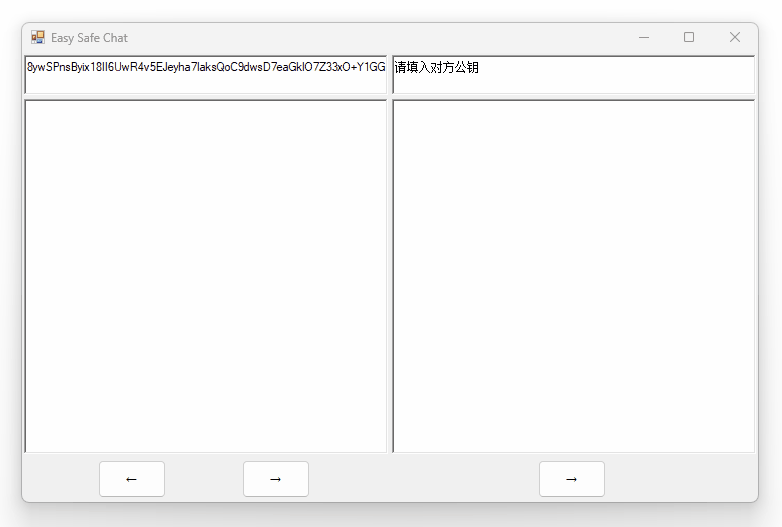
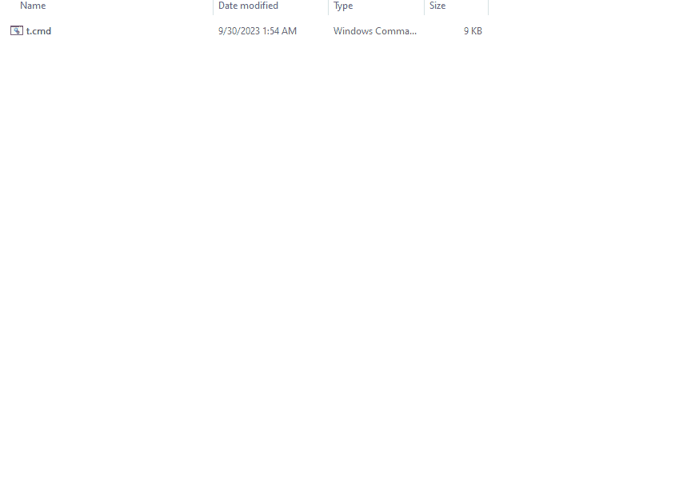

# EasySafeChat

## RSA介绍

非对称加密是一种特殊的加密，加密和解密使用不同密钥，RSA是一种重要的非对称加密算法。

RSA有**公钥**和**私钥**两个密钥，正如名字所说的那样，公钥可以公开，私钥不能公开。现在没有有效的方法从公钥推出私钥，所以可以放心将公钥公开。

明文使用**公钥**加密后得到密文，该密文只能由对应的**私钥**解开。设想Alice将她的**公钥**公开，Bob收到该公钥，用其加密消息得到密文，然后将密文传给Alice；就算密文被第三者Charlie看到，Charlie不能通过公钥解出私钥，所以解不开该密文；只有Alice收到密文后，才能用她的**私钥**解开密文。

同理，Bob也可以生成自己的公钥和私钥，并将公钥公开，Alice可以用Bob的公钥加密信息，传递给Bob，该密文只有Bob能解开。这样，Alice和Bob之间就实现了加密通话。

## 演示

这里使用了自己的公钥。实际使用中应该是填入对方的公钥来加密，然后将密文发送给对方，让对方解密：



## 软件介绍

头部两个输入框，左侧是自己的公钥，如果为空会自动生成（公私钥），右侧填入对方的公钥。双击可以选择一整行，便于复制公钥发送给别人。

这两个密钥文本框分别对应`MyPublicKey.txt`和`OthersPublicKey.txt`两个文件，但文本框内容改变，会在500ms后更新文件，所以请不要在软件打开的时候直接更改这两个文件，而应该在文本框中更改。

自己的私钥保存在`MyPrivateKey.txt`，请妥善保管，不要泄露。

下面的文本框可以输入明文，或者粘贴进去密文。`→`按钮用公钥加密当前文本，`←`按钮用私钥解密当前文本。

## 一种很新的软件分发方式

这个软件非常小，压缩后只有约7KB，base64编码后也不到10KB，也就是一万个字节。有个词叫“万字长文”，也就是一篇长文章的长度。如果软件能以文字的形式传播，那肯定很新奇、有趣。

于是我写了一个cmd脚本来完成这件事，将脚本文本保存为`t.cmd`文件，双击生成软件。

演示（注：第一次打开会生成自己的密钥，所以等待时间较长）：



脚本内容：

```batch
@echo off
set f=EasySafeChat
echo UEsDBD8AAgAOACMHPlcUVGJHrRcAAAA+AAAQAAAARWFzeVNhZmVDaGF0LmV4ZQkEBQBdAACAAAAmlo5wABf37AW76vT/lAEvRO985vUJGUQCKf9TzdbRFP6eYZyCFfYJeqxrtO1UEJ4mynHPxUcryOsiRf5B+rNZj3IECYBvOmxexVQF3KgnEQpcn49Rubxl8CRfPnts2bDEe5gtHzntaLnwO3tQJp90nXx3hzun69nnXgWGudDq6D0Bb2BdNIkltj5hBJr5JGAUdnkLaQ9WjfMtQutZWwEqymSRbiE88Z//I8fx5IAtywvN7lI3JTqpsq4/+218hmRKzJweu6Qhhu2xmmlOXMCPSQgNl0kc6bxWh7wvapWIoLx1VB1k6Shxdk2lZ8Ec8cWC70V915mYH7hJPtMfubAIXz23g+aNznJNsBKEo6as5D0h9eOqjKb5IrlAkTyspMQ8NIZFNJb89B9r/VbWwn3uazUn7r4DVk8/giQf8Qgddn1JOPsybxsLLwHBzNlyneGBPEj5qL1rFYEEOwl1AgpQcpeYYUDCAUkcDSgXdRKlxQhY3kddV4BFq57zg17YURbAqKVSKPgRJMxMine19Ua4hmwEQApBTEhm5BNAwHG0dZsQPXKko6PFIkVIDmxlfm4tT7N7F//sRcS82JsohzgDX4FpswHunteIOclw111cdtTH6Tkp2PEWzvBa8ZicmJdykTbkbInUabTK/UExUdGgeb+FHtzeCx2wqkfUSqsz0YYcpXXBlZrqS/SFobePrbFrmPb7Q/hrDZoXZTGKP9c9TnCZdDaeCXTdAQxSTi0qz9+n9cCjbQt7DCppfn8O1x1hMM89dP2eEayFmdM8CQFopZWeI2VUdOOXl5Lw34skqpjD9KlWv/ICeCclgzetCu8A9fgDzvH6rNBPLva/Cedxy1ljpIURR+GbVFTYGKW0q0FZWZk54V3tySzm199TywgV8aeZ9bODigD/wa9cgPDAWejpSiRWF68SBef088eILdYqnYLeLUWdZS9wtGng9RWvUsDhh5zVSfDgS4Y0N6TJOQ2vSil0dg1y4yMSX0WIim61Ka2MP08y627l1KLdiftQFNqG5AgfQjsYTKfcVQqVVuGyf/qwn6QYCzLOF1+/7d0vap9SRPTs0rETPaK0gt+xRh+Q8przHq0G6tPzudFjdzAfKjPEXbWC8G5uTYWrdMRve1QZl8eVj2H49ux0Db6Oi4Et/z62xO76JiyO18mhLKi45ZhDEwGsfyoBNRSTV9brbfyvvBsLCLDiEtE3AAMCuIZNJyHLi68Xv6XGOqOFT4ASaUa4UTruap5tgyUK6d1WLV/sfQ/57Xr3KDGl/Fbal9/m5j7db+9iWnAF1k7xSh5ShJIT1+bXyOj/A/8tq44Mx5O84r/agKp0x0QN0jr2hasxtOL2xhQnIbFgo9c1bEra6dxwvMr2w8HgEcHQlcH6vlOLJqonBvokX0WHJ+/N66dHWHubZPLt1w4gucRDmszx41LYF2jexTDxBh5X2P7+uu+Pjc1bEclIZo1CUiv09x/5U2MK5xLeZkF584KoFSoEfQ/thXbDWISiBvYMUM3qptbf59FNiuXzyFahCbIbcIx/knMu3uKed7UaVMbB/QR5E0JVgsr5On9952EvzKO8xTk2qYkOwJM9ocTrSK+pXb/+cKKc0Ice90U0ZGrNvNy0/OoFo3S9Vqjc2TKlkUTrjAsdpl3mdBdoKSngjCCVgMwtBV3iBrY90/8NK75Hy7LzqBr0qKmEmvPoA2Vv3qcCQ8rkyqTNUzLqD5La2y6Doj3+ZDbM6p5jgg8gA8+xMBqZJgPHx9Z9u8KHyx2sNi2OXrqN73OouZAcgKsXiRTWVXmeaNNZs/EkNfiXODDm0slbdiphzydxhDfLQQey1VYW1CyNZxsipTGZYgkorFsURuwbdDSCgIoVmnAMzLmMJzoeci1sf1vlZRICGczR118qZ3FmfIX2ON5ncBkv+e4IywTUOswJSuX+sDRWGh9/SNfWZJLI3uQe/vkQWONzC0czN6Qepwa8> "%f%.txt"
echo WafxTMejjyat5vqr2sskbc8atWzyiOkwtj4TXbLOYCU/JllHxGlsgIHeDyRVo7jJR8tG67whhy6+GLcjHb2156pp8fWlXtZGS+dm7hJZ7tjISRBw3VLCplERnDI0Y7Xwl7oIpcDBVJ7Fe4dpR5ZFLk+k9OVMD0q9oDb73kqGYxR/pdkphOKuoyvKOV+ZrGRoRiWeDKYQ6FNvMO0l0hwDgu4sHPAT4tAOcGPH05msW0c41IsV3FT4WCYmsxvHvNCEwsLRa4ftmQ49elt7JQYxjn9Aiv1/6eRhfZPtmnc6bZPaCsvhM4MlDssOtq3M0QQhRCezlAZ0947jzYrY4YxgE5GSn64Q69AO6YapoNXIK5YY2wvkhYCCRzM/zKVfEwZbq7P2bUTT+Be0CBfHD/B/xMGQVX/JA5sG75nOhZhAWKKaLfKacb9fF2YlxEvKTWnM/5oxB6FpXSSwy7RH+lTlnnf1b74Ok99ZYGaoGCKRnezvYkbgA2ZR3TbBeZrGrv76AXWSCT3GXb0sz8a5RPm3OvKIPnCS5BG+mgHZoTNEeHKCulWEnsS/CNO/vnMcBuCTXo7awqCHDtwdIBaChG/avBrIdYuO93p4SzGXEVmnO/sGUK+UWddZM59pDGN89Yag2CCwWevKXuuW7/QW6hL015sRpOGTJXoT5u1nQdUnin3h/HZB/59v2w52BVclHDM3ADQ2jolrDHa2zJCLMwmvCZQmqJ5okJUiDFUTM7+BFG/74u3IVXhq0sjdB+H/8eVPu5M6UE0V5nYqTEa0+aqfv8y+6MVco9T+t0VS4NsN9Z+Tjx808clYNncJdfufqP2i3zTOXW2wkgnyC7MnCc0G35KnF/IFOG0Dwaz76b1CAAVfqpmAW/1Z8ZXYB0bAi5veN6jZMqfVkQTA9/eKjvGnlhunCjK9CawIPyX08lkDiEKR93J46OjIrqZrpz0mYotDfFlz1WLERbYpHvFeocMrsA8mq5cRwfMnEBR8QGYw/nNIQK5BfYyGYGI2RfiPDBYEUfDyCUW2Qdxw/qTLEkElQ7MbD4TpfWcSrhs3PkfT51WK3pEsu6GSRPQRbQfrJZca+ue+1rp+iYV8IFhlLdgR4KN+qfn+dI/CJ031Ub8nhDPHYoF0CgVujAy0P7nvdEDMwlAgbtB+eE96BqvHROOQ92+I8s9DukJANgEZKmMHS01qFTkWBXjdf+Y6hmRmlCUUL83xsDJH0KcfvFMtvFq4UaFe2WovoxqMe8xIIwzj9FIWu+Pl1zmkPPCaTmpSgp1hhe+Yj+TytrXfavCqmMxR5dTyqFN37FNR2YqA1l+tanHuDTX8VqrRiwx1rXOzeJeg4Km+4cJ1yD3MZmJHK1c5sKoPxPdO9Eh/dPVEMi/yFRQnXsm3SOSpLjsODdwYU2YorjJ9LUR4h2kOuzbyycCOEKvioo2dE0KYqIvyjQkZjlY00k+5a43+pwvapEacveDC09x0JZ+PvCoC0vH9x9pfsE6d09wJ7zBeny9osxcwvvYh4c51+e5+REioxRPXSGtyYCSr9ezKzMDgjrdAP1d0ECva6yt5YfbwAqQYleRwDH9/q4rwugLdq+NqHJz9FqGBm70VXdRGPuh5gO/REYyxWQFjVLxHMLv3mrNOXUNOgrlaONEq6PDGd/ebfVqcs+64eyf/JlARQMk+dm0SN1/3Ixg4JhTrG5rJoPP7/wZy4A4hw1BthK3b3Ov5liwH9mOk2nWWlIUwD79GE63T6kaa34SYgcMkEXCs01tL6I+1+rj/Gnln/c7t6jcMF1Po6xlV1Ap0ddamCNoPdXvJpDZ7B+CnIOV0Y6qHjl8Kd9fg7moUk3ggegBtNE3whjzl4Ox+cnNLgoV1JlPzfqT4XcI6NIGQlqonYqzmz+09CbasynPvml/oBEbAiFRKExYfH3EP+oEhYtppALaaDkD4o4U89GuxX216ZK3ACwB4im2bkHAoYdWJLksho1k6wqMBY/rxUMYmVqpsBxaYeIWgScw2KvgAb4fCH2GvlgJ9Y9zwPM08k0TPmjjqIEXyCK+qpqcj>> "%f%.txt"
echo pHvZKckxKHsKwN+66STMkB3XEfbQA/cnh9olxIac5TSGRYBz+mw06atRehOW8uTJudI0UJ+gIAKa0IkITWPajPXUCUkkpQqwiFjrMHflB8M+Tyn8qw0+5VKQg3DKia12y6AjDrI7ZlPWa8LNWhEYDQd7EhtXXhhZJcY3ihv7N8fJC+uk1AhzK5ZKodD8TzaGcvppPP6TpkXc+8PxsTVFy3gOHefZuQsRbY+U6jQlQMu6U4Gowr7kC/Ot+gWtZ9WsUtwp802XnJ75NHWPzm1shBcUGr1b2Crm1gfCIbf1Zj5vxkBdB6KgdyH3D6OcDiyYjBFz+HUPkjTIqgW60BQE6Nwg3GTKLBU3e3my3WPsDDK/C25i1wrg7J88mIc1GfTN68Dzakx4XWnaeUgEQtmfjMthcGotbu4uWFaXS4FK7f2/UB1lExX3g3aWJk+a/3IfFbMnJm91tfzEUxkDd2e/EV+dTr7T7ys18JkkfP9XJywR/TN3bdyDWnBrBrUmiZo05DgYztCpjCtDWmXIPRJoqmMj0pmemfeHExF4sSwCrhFDUPJsC1O9QHjW7zeUd0C1KJT332MoaNun9LdKhqnQxTxK/MIvAYqlh5fwgbq4bYuTiYq3gE6g3APsGuKv60RA9i/jSeUir7a0v2C7Y5bmawy3XHtL5VD7uZ44+Ije6jpXzALfCBUywDRXPRrMoE5ev1L0yZ60AB0CoZwKMtbQMS/DG4T+EqV7MEx74iObl/U/QdOkWPcIQ+1TfhGgN1I1HeqS/8zNxrFL2LMbwmCW1XQ3o2V8ZgL9F0lY4QqwcdgkmxwpUp4Jp4usMyS4jojf/vXJVp/Wm3DIx/lY2a8z6MAz5YPc/HU/8OWFru1af1MM5oBPdRaCCxeXTmmP5XH99/5qlxYpfPpFfh9PnZc3QQTMm+rE9YD9Ly87+6/4koXqMfnLyfCnaDsBBWSpeCFe/VXHay9+2nm78sJVWfO7fp1zw6MRZ6HcchcEVBBa1khchI3yhhVFDdls8Ub85U9LCuvoSgtwVZZPpD9iLt2Hnwv3makxDndvKXRO1k5TRl1RO+N7tfc7o/rlskM6g+k2Fdlqt5NVYJ/A2gMqoj+3wjppuZlt4RO4gBxt0kaL4BiX6Mh/6/4rt/PkJHX45rGYrMuRV/Kly1DASZrXzpxO3NQujKWqxJx/7kQMEaEsFZrMdRec34I57+Pu8as1z5XhZzSbqhnAgzhxvNSiPlO/1rfIAmePx1yaCpz2tVF42JyhfD1mEJeZp08Gy6eExguD8n1USXxA/fpvLxAMYQ9HNw91tDDaHT1T0fMk08nCEak0YJ9axibPMFmNB/IGGjYGn9OC8oA+BnjX4w6hLrKOoSBGDC3CaQDRd/NFI+X+0HgeotiYjxx4PtC1E4OxBiJUmjijVUzCzzkxve0dHNFrI5ILI4xqRgOGtqI4LYZubB/dMhzyEi924kcnp34gihcy56e8bnU0rEydfEiHb4vak5UgKm3MEdGjgJ/wBvxgDcInEDQU2+77iHpdhZbYQdvLrzFU1RS1Lobq3Fv0HXC3VkN+HtEmw4VlvZRAtYD1ahyfGWPdkElb7GHToT/mlv3VgPs4Cl3R/i0khBYE58/QMxj/nTE3Vrx1IwjVMYp7XI/M1/NJhWkOuJJV3dlVHvS0ajmB7Lo/IPxNI5RHmfH+lGW9mqhS3jT4CsE2LNdveXWmTdFINVbptNSIvzLM9eVc4fON0Wwci5GmkFgJ3+OQWJsiPgOHho+XgjC5R+RQ/DdUnfbP+BziL1U6FgaGECs7IlA/rrqJt2d32Bvl/j6xRr/Md9L/uwoEN/g74TydGrQsdsEnvHMS0VGdbKeakhCHYBkzn0fmE34NnBOnFjALjI8jhtWM6tfzSFLnzO8uN2rVxSDZA4nTiUiPWnykVrDCGcjFnQpT3FlXKLIWtqP3x8v/ljbboALtzQ66ZthI7E5O2ANYSiFoDV8aniKABEnogBdvUjIkPYNoqALa+s0+/D6OYWuQRbOBcqtPdn8hsOhWhU3jdphZuLE4M99yIEnd>> "%f%.txt"
echo hOlwx31gL6VSkN7Moal8DzbXr1QNco1Kedc9wKWbGoXpEdJWSUlrxYCysd15XBb9dtsJDJrUeZje4240HROfubgP5EMHTLcXI0yUMf7a59OnYyMF7C9FKFSNvHeuDeWz29p2WnUj85rcnpxWo82kxjFlGOZJ+1Su3VQOSkLhVA8frpAI3Jn3RX5l4QiHSOhxDVwGlCLbKfB6sSElwSZDxtu/LkwzWx5DQo1yMbkzlZf9YCGBhZR/5PQdjBVAbnQnhsp2TFaZEz+EherslERk0d2uh+bCxEr0Tv89NE4xviDB4Dy2/n95kF30JwHvf1QAbQpmZZOV/uZUqI53vYs0g/0h9sMOR73ElznOoimDmQERqsHBhvldk0F3i+bnWM2uRlhZoh7B8cNAr7KaJuwxBf67d+xBBCT0IYyGo7qPLnLzyXEm0jiA0whnAL0jJN4s3KVgOi8Op8Zh2q8+kEBIGzzQuE9C+mOoXBot945UK/q+qHvRjXCcQyaTyjfyRVxmaVG8TM4riRiFz4FMMVSzWTbG+4/lpFXQgf8E8viuB2d/Mgos3jWpARFg3BxpvV8vSUbuhYcUR1QHA8b2DxwEdJ0UVxGY0DpI51GFfhqKoq52hOu8mkwV4Fyxver3pxFvRKdU4AsQB9Ua6I/k2Kj1LbdZVauyrQkn0cfftWI1//5IPPCIOjsBNVWBwzn5cg6vpFWJkhqEJVo9tJgrtLrHxeeyzdlHHrBHr+weEjm5D35y1tj7/qfIUdP0dE7RW/RrA0cS/jQCElSAx28QwRauKmHmO8/RiLszpEbptk3qjjSiJqZ5ZPZ5jijkxbl5DWQblBZtCB+iUqNgk2RbwTn9AZuxxjpxTaPyqkZS3LM00Z3j84wwIDb6Ujedb9r2D9pxhGT4v1W2AvDP8ipzz+YTKO0cIr/6glHo4S3N2xPpTYmX12BYaRxWK3i5/uQ8TnYp8i/y0Mh3JXxQaQnExcp5xT1doDGCX8z6Wn4TBVO7659R95XUomhM9h7p4S5xg2/2c43ZDk95cw4vYIe3iaXnhi79RjBr5rhHUtkVw9iipWlaMjTOh7Uwc/XxBAQRGOAJvA+J+R4DulofV7egEpKbiwaIsvnQJa0+uxmcke6Ulb7HnBCaSxmSEUsunapAwkTTg4Q2LUY8S8B1Z6E7/pgV/PD55Wka6WmcQljl8NS1E9+gKqq0OwjjrBk+WJq8ir9fDSnEQHkusbsfcog8v8ME2PQ5dv4CMzrKA2kc1ALtuS+RTgktTMIEMo8bLHOYV3sPlU/tj903NwrWIrOBTtBqyoZExnoSIUYmW/e6T+FZ+L6je3glg3SWXgK/qr0vyR1LvlHFdgUjHLObSQxBxFK3fC59chdgWwlYk1Ep9qzufgTo+gDyFbsvY4H3HNxxuUkolddijIDjXhYMLde0B4S630k+lAyPq4VPcwfg+oSubjQJ+s6SmI40TNuyEvBiTlnC7/efXErayi4P8p3arKbL2hn3VFZ+Uikr/9kA8/vXOL8h4u9Pz5WyKPfmC5uSG25JqkpJzQpmEAOSp5UnwrddTX5EE6HoPhF+8wP2k4lLxDtVPcJmyHuAx/lC0i/qjLbNAjyBnbzMgGIHZ+wMjLQYGuN38XlfUPC8+n739nq+khL51vK3m74wFd+/AOkL6J9X7nUCUcp5sogLkqRayxiwSJePWNHqQ45GvlYOB9tuY8YV3+RlPz1LlI+z7rlbBEGoK6xzIoqkNaCujFqBYsbT/DFiyvY/3dnIDianfvSxkYgli3+9QNiKE2hUHxZv6N0bkQYDGg3GC7y+8isvCoKSq2oyllIsGvhzZ/NZ7ObeeKODsrxa7diGqorPU9yONI0x1oBG1Z4VFr/gQcf+48wbEXCUKIV28EcvzyQD9Q0wOdgmD1GPDdBmtCfktG9BLFCwIF4X/lLS2Q6+tlNh8ySoyaBnD8e21asckV/gAwTtA1dH3WS7Ig4T3enIiXImqnOkTfcDoosf//e3MORQSwECPwA/AAIADgAjBz5XFFRiR60XAAAAPgAAEAAAAAAAAAAA>> "%f%.txt"
echo AAAA/4EAAAAARWFzeVNhZmVDaGF0LmV4ZVBLBQYAAAAAAQABAD4AAADbFwAAAAA=>> "%f%.txt"
certutil -decode "%f%.txt" "%f%.zip"
del "%f%.txt"
tar -xf "%f%.zip"
del "%f%.zip"
```

其中`tar`命令需要Windows版本大于等于Windows 10 17063。如果删掉最后两行，那么会生成zip压缩文件，需要手动解压。

## 技术细节

- RSA是4096位的，足够安全。公钥存的是n的base64编码，私钥存的是p的base64编码，e默认都是65537。新密钥的生成使用`new RSACryptoServiceProvider(N_BITS)`，其中`N_BITS`就是4096。

- 文本框编码是UTF-8，所以支持中文、Emoji😊等。

- 使用OAEP填充，相同文本每次加密得到的结果也不一样。

- 长文本将会被分块加密。4096位加密支持的最大bytes长度位470，所以文本经过UTF-8编码成bytes后会被按照470的长度切分，然后分别加密，得到一个个长为512的加密bytes块，这些加密块会被连接成一个大的bytes，然后进行base64编码。假设有n个加密块，最终的base64字符串长度为ceil(n\*512/3)\*4，n=1时的结果为684。
